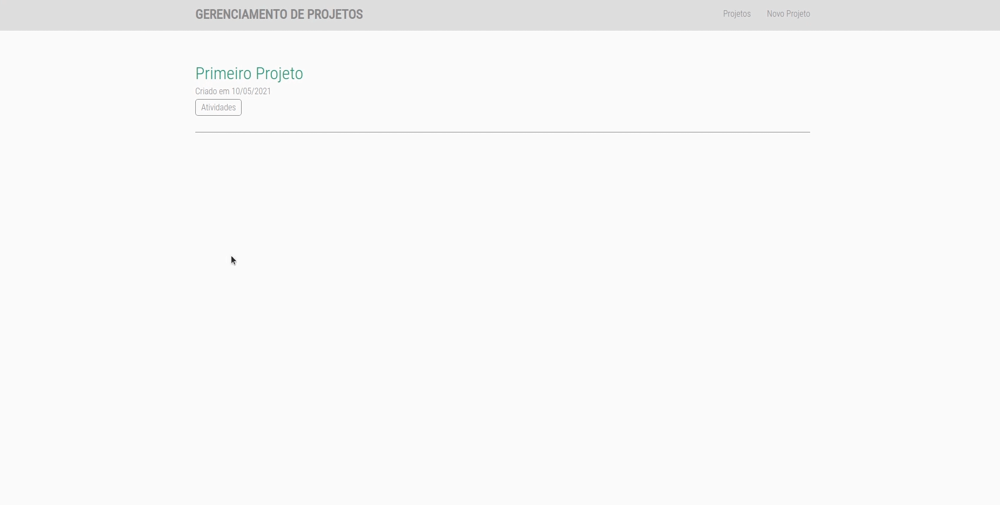
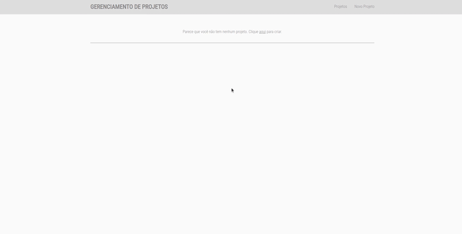
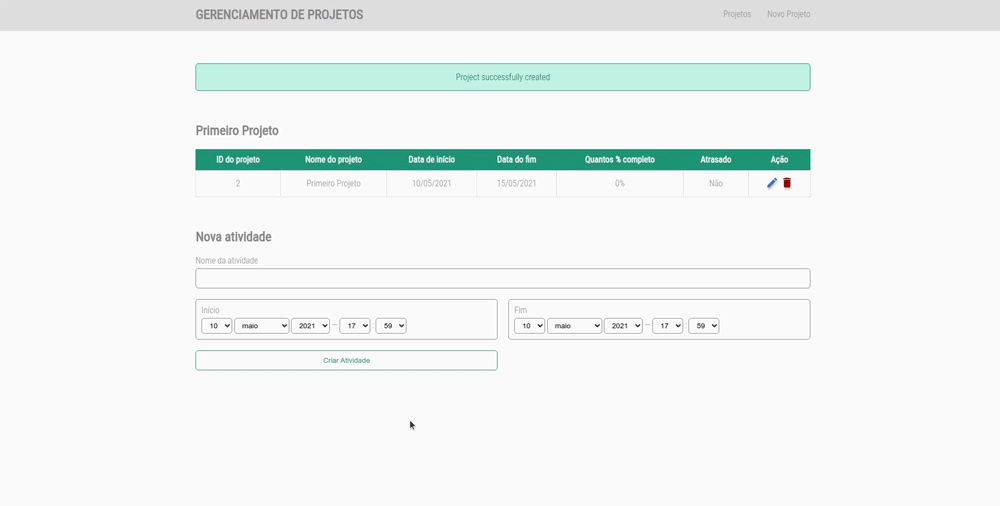
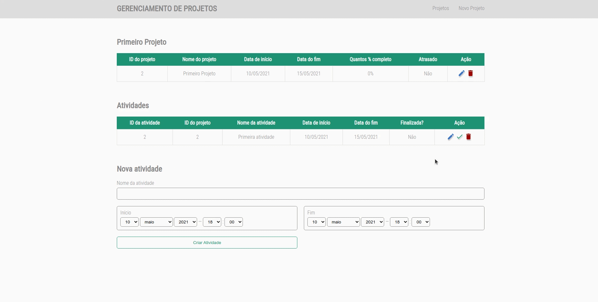
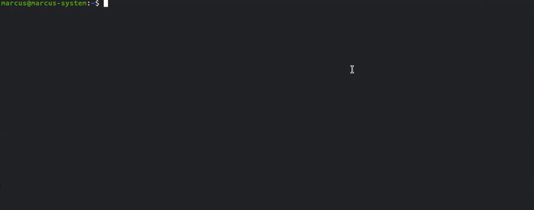
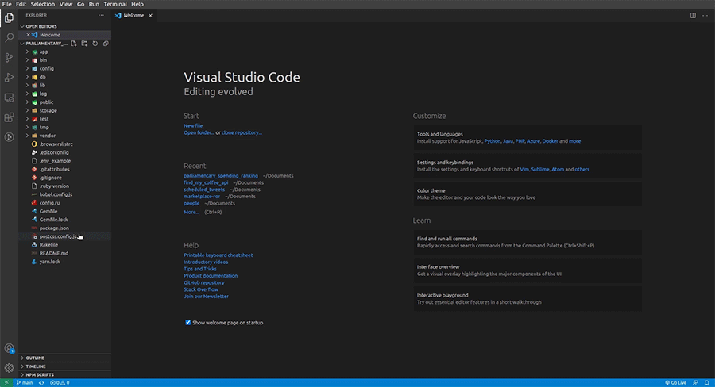
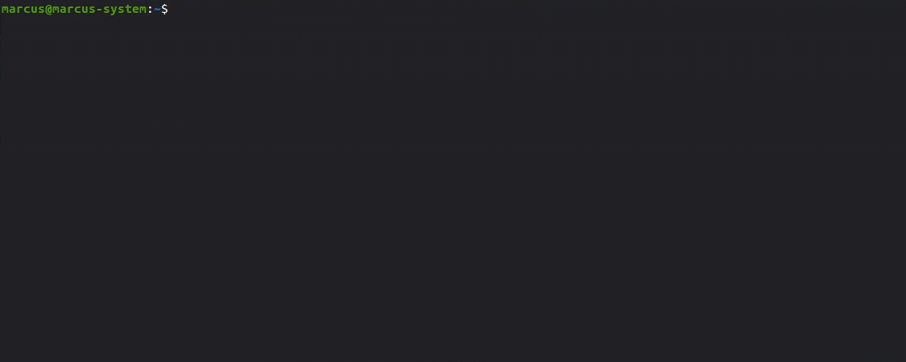
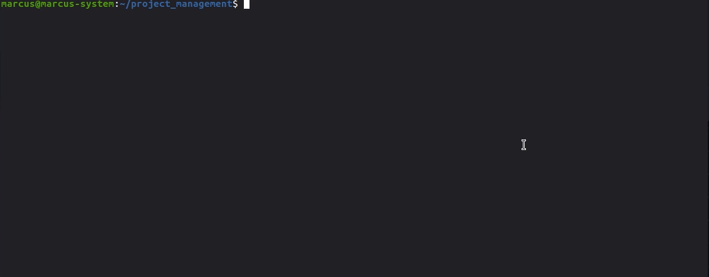
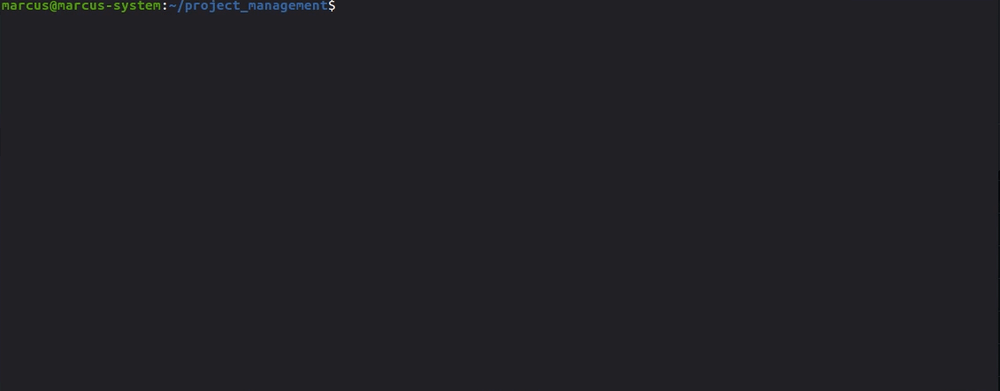
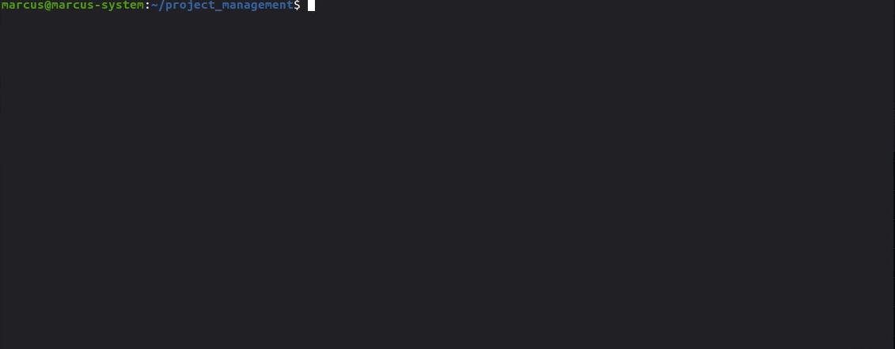

<h1 align="center">
  Project Management
</h1>

<p align="center">A small project management made with Ruby, Ruby On Rails, SCSS and Postgresql</p>

</br>

# Content

* [Features](#features)
* [Installation](#installation)
* [Getting Started](#getting-started)
* [FAQ](#faq)
* [License](#license)
* [Authors](#authors)

</br>

#  Features

* List all projects created.
* Register projects for better monitoring
* Register activities for the projects created to check what should be done
* Inform whether there will be delays or not.

</br>

<p align="center">
  
</p>

</br>

<p align="center">
  
</p>

</br>

<p align="center">
  
</p>

</br>

<p align="center">
  
</p>

</br>

# Installation

You need Ruby and Ruby On Rails. One of the best way to do this is with [RVM](https://rvm.io/).

Now you need [GIT](https://git-scm.com/downloads) to clone this repository and then clone this project and follow the steps in order:

Clone this repository.

```
  git clone git@github.com:marcuspereiradev/project_management.git
```

<p align="center">
  
</p>

<br />

Inside the created directory, configure dotenv changing the USER_NAME and PASSWORD to your postgres username and password.

<p align="center">
  
</p>

<br />

```
  // Install the dependencies
  bundle install
```

<p align="center">
  
</p>

<br />

# Getting Started

You need [Postgresql](https://www.postgresql.org/) database for this project.

If you have [Docker](https://docs.docker.com/get-docker/) installed in your machine, you can install a [postgresql image](https://hub.docker.com/_/postgres) and after installed, set the port, username, and password.

```
sudo docker run --name name-of-my-image -e POSTGRES_PASSWORD=mypassword -p 5432:5432 -d postgres
```
```
sudo docker start name-of-my-image
```

Now follow the scripts to run the application:

```
  // Create the database
  rails db:create
```

<p align="center">
  
</p>

<br />

```
  // Run the migrations
  rails db:migrate
```

<p align="center">
  
</p>

<br />

```
  // Start the application
  rails s
```

<p align="center">
  
</p>

<br/>

Open your browser and access your localhost

```
  https://localhost:3000
```

</br>

# Faq

**Question:** What are the technologies used in this project?

**Answer:** The tecnologies used in this project are [Ruby](https://www.ruby-lang.org/pt/) and [Ruby On Rails Web Application Framework](https://rubyonrails.org/) to follow the [MVC](https://en.wikipedia.org/wiki/Model%E2%80%93view%E2%80%93controller) architectural pattern, [Postgresql](https://www.postgresql.org/) database to persist the data and [SCSS](https://sass-lang.com/documentation/syntax) to handle the styles architecture and a better maintenance than normal CSS.

</br>

# License
This project is under MIT license. See the archive [LICENSE](LICENSE) to more details.

</br>

# Authors

|  [Marcus Pereira](https://github.com/marcuspereiradev)   |
